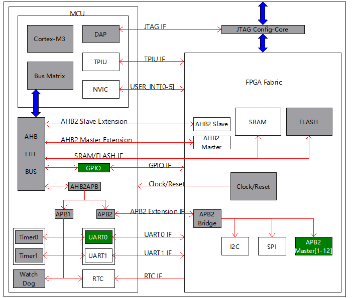
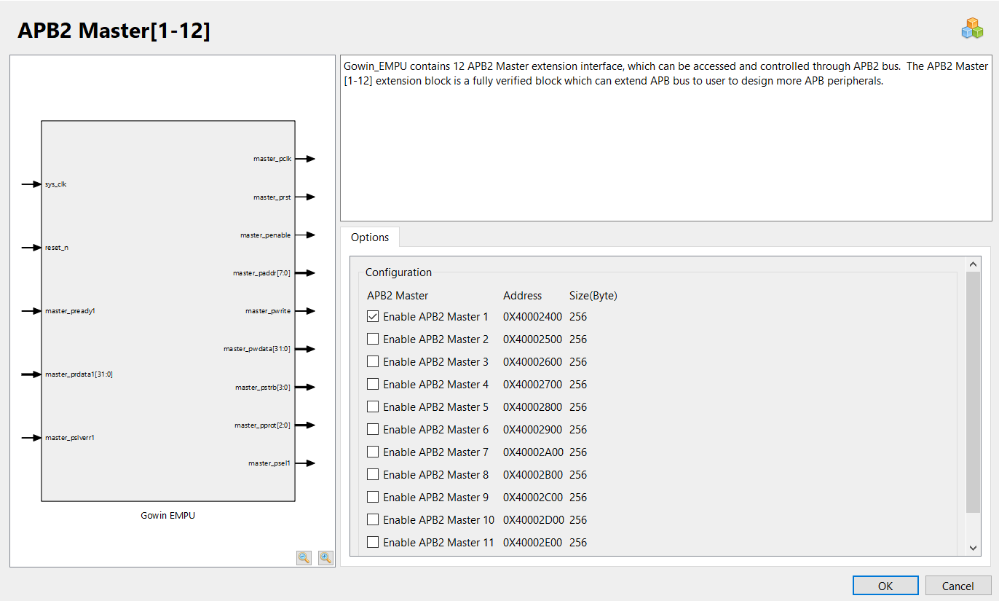
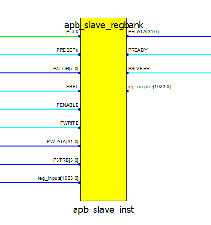
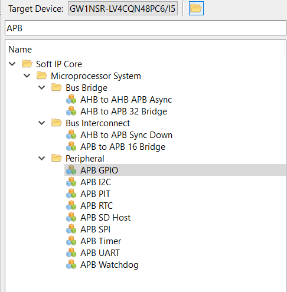
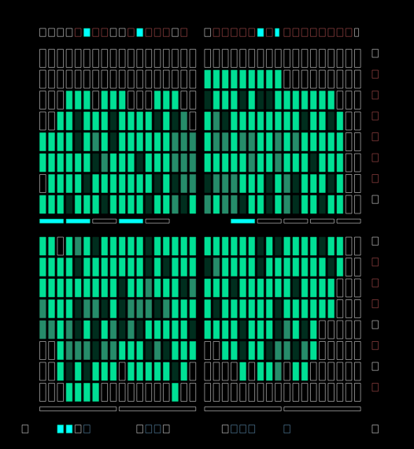

# Tang Nano 4K — APB Slave Register Bank

A hardware design project exploring the hybrid FPGA + ARM Cortex-M3 hardcore architecture of the **Gowin GW1NSR-LV4CQN48PC6**, implemented on the **Sipeed Tang Nano 4K** development board.

The core of this project is a custom **AMBA APB v2.0 compliant slave peripheral** — a register bank that bridges the ARM hardcore and the surrounding FPGA fabric.

---

## Architecture Overview

The Tang Nano 4K is built around a System-in-Package (SiP) chip that integrates two worlds in a single piece of silicon: a GW1NS series FPGA fabric and a hard ARM Cortex-M3 processor core. They are not separate chips — they share the same die, connected through a standard ARM AMBA bus infrastructure.



The ARM core communicates with peripherals — both built-in and custom — through the **APB (Advanced Peripheral Bus)**. Gowin EDA provides the APB master IP as part of the hardcore infrastructure. The designer's job is to build the slave/controller side: the peripheral that lives in the FPGA fabric and responds to the ARM's read and write transactions.

---

## APB Interface — Master & Slave

### APB Master (Gowin EDA IP)

The APB master is instantiated from the Gowin IP library and is tightly coupled to the Cortex-M3 hardcore. It drives the bus transactions initiated by the ARM processor — address, data, and control signals — following the AMBA APB v2.0 specification.



### APB Slave — Register Bank (This Project)

The slave peripheral is designed and implemented from scratch in VHDL, built directly from the AMBA APB v2.0 specification. It provides a clean, fully compliant interface between the ARM core and any surrounding FPGA logic.



Key characteristics:

- Full AMBA APB v2.0 protocol compliance
- 256-byte address space — 64 x 32-bit registers
- Address range `0x00–0x7F` — Read-only input registers (data arriving from FPGA logic)
- Address range `0x80–0xFF` — Read-write output registers (data going out to FPGA logic)

The ARM writes a register. The FPGA fabric reacts. This register bank is the bridge.

Note: There exist IP controllers which can be conected straight away with the APB master
  such :
    

The choice of implement our own slave (REgister Bank), was made in order to have more friction with the protocol such that we get a better understanding of the innner workings.


After Synthesis & Place & Route everything is finished, and heres how the fabric die consumption looks like:

## APB Register Bank Verification Suite

This suite provides exhaustive validation of an APB register bank implemented at base address **0x40002400**. It covers **32 read-only (0x00–0x7C)** and **32 read-write (0x80–0xFC)** registers.

### MCU Interface (ARM Cortex-M3)
The register bank is accessed by an **ARM Cortex-M3 MCU**, which performs memory-mapped read and write operations over the APB interface.

- The MCU writes test patterns to **RW registers (0x80–0xFC)**
- The MCU reads back values to verify correctness
- **RO registers (0x00–0x7C)** are read-only from the MCU side and are used for protection testing
- All accesses are performed using standard memory-mapped register loads/stores

This simulates real embedded system behavior where the Cortex-M3 acts as the bus master controlling peripheral registers.

### Test Coverage
The verification includes:
- Bit-level integrity tests (walking ones/zeros)
- Checkerboard pattern testing
- Register independence (no cross-talk between registers)
- Read-only protection enforcement
- Stress testing with rapid read/write cycles
- Address boundary validation
- Data retention checks
- Sequential and integration testing

### Results
All 86 test cases passed successfully:
- No bit errors detected  
- No register interference observed  
- Read-only protection fully enforced  
- Data integrity maintained under stress  

### Final Status
The APB register bank is fully verified and compliant with expected functionality.

---

## Repository Structure

```
tang-nano-4k-apb/
├── FPGA/ # fabric related 
├── MCU/  # firmware related 
└── docs/
    └── images/               # Architecture diagrams
```

---

## Prerequisites & Environment Setup

This project assumes you have the Gowin FPGA toolchain and MCU SDK already set up.

For a complete walkthrough of:
- Installing **Gowin EDA** (FPGA IDE)
- Setting up **GMD** (the Eclipse-based MCU firmware IDE)
- First-time **Cortex-M3 hardcore** configuration and boot

refer to this excellent tutorial series:

> **[Gowin FPGA Tutorials — gowin_empu](https://github.com/verilog-indeed/gowin_fpga_tutorials/tree/main/gowin_empu)**
> by verilog-indeed

That repository covers everything you need before touching this project.

---

## Board

**Sipeed Tang Nano 4K**
- FPGA: Gowin GW1NSR-LV4CQN48PC6
- Hardcore: ARM Cortex-M3
- Logic cells: ~4,608 LUTs
- Onboard: 27MHz oscillator, HDMI, camera interface, USB-JTAG
- Price: ~$20

If you are just getting started with FPGAs and want to explore both programmable logic and a real ARM processor core on a single affordable board — this is an excellent place to start.

---

## References

- [AMBA APB Protocol Specification v2.0 — ARM](https://developer.arm.com/documentation/ihi0024/latest)
- [Gowin GW1NSR Series Data Sheet — Gowin Semiconductor](https://www.gowinsemi.com)
- [Sipeed Tang Nano 4K Wiki](https://wiki.sipeed.com/hardware/en/tang/Tang-Nano-4K/Nano-4K.html)
- [Gowin FPGA Tutorials — gowin_empu](https://github.com/verilog-indeed/gowin_fpga_tutorials/tree/main/gowin_empu)